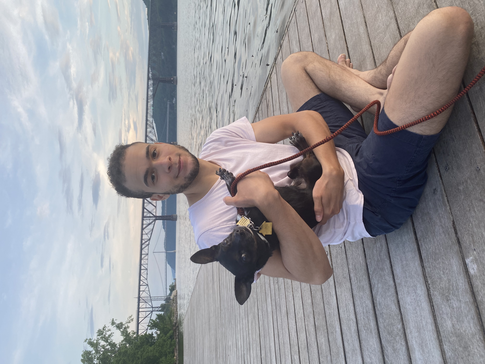

# web-programming-classwork

## My previous programming experience
My first experience with programming was taking the web development/intro to programming elective in my senior year of high school. That class piqued my interest in programming and helped me to realize that I wanted to go into a career in programming in the future. Since taking that class I have taken several programming courses on udemy and received my Associate's Degree in Computer Science at SUNY Orange before transferring to New Paltz. This summer I was able to do an internship for a tech company that a family member owns, and had the opportunity to learn blockchain development with solidity and web3.js. I also had the opportunity to work on the back end of a website that their company is developing, and learned how to send requests to REST APIs using the OAuth protocol, in addition to greatly strengthening my PHP proficiency.

## What I hope to gain from this course
While I enjoy programming and web development, I think that my web design skills could use some improvement. The vast majority of my college courses have focused very heavily on computer science theory with most programming being done in Java using the command line for output, so I believe that it will be very useful to get a chance to learn and apply the many practical skills, technologies, and patterns that will be covered in this course. My uncle recently asked me to develop a driving school software for his business, so I am specifically expecting to use the skills and frameworks that I learn in this class to build a cleaner, more functional application with a more elegant codebase than I would be able to make for him right now.
